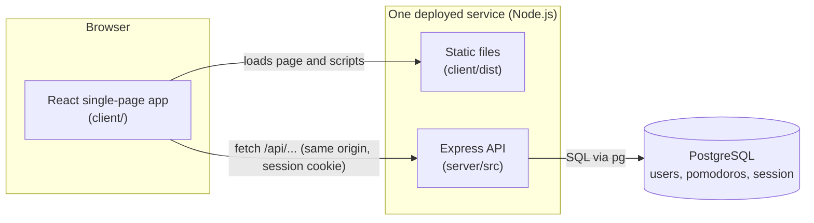
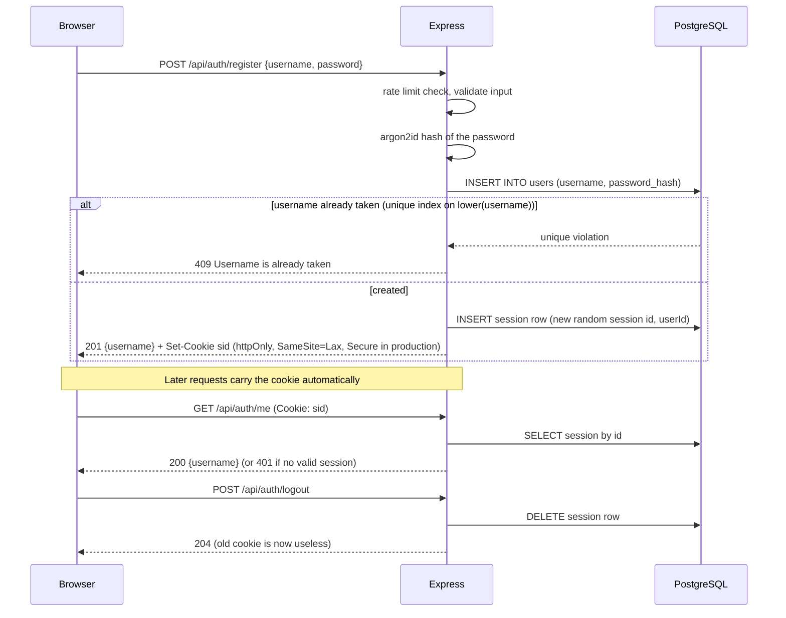
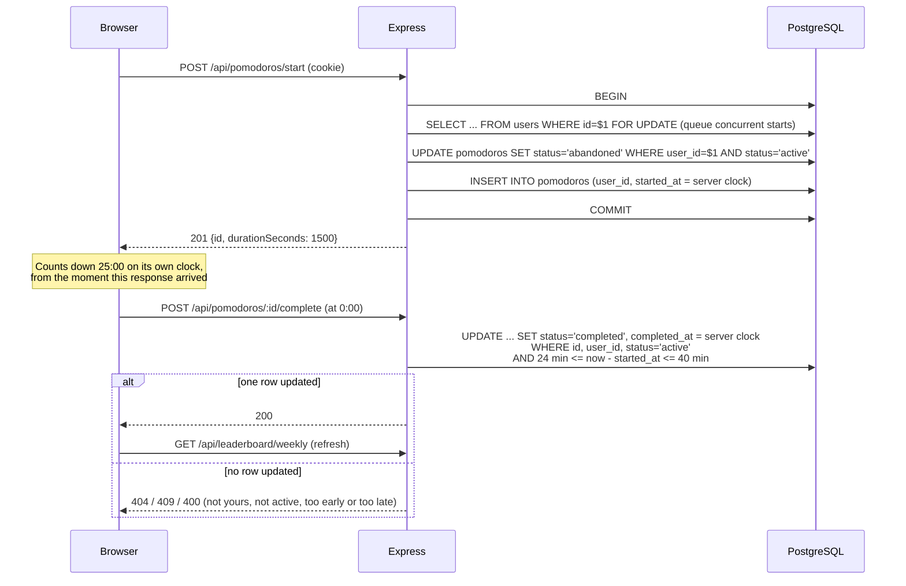
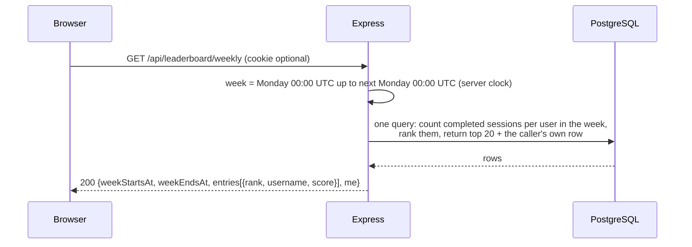

# Architecture

## Components and where they run



| Component | Runs in | Responsibility |
|---|---|---|
| React app (`client/`) | The visitor's browser | Shows the forms, timer and leaderboard. Counts down locally. Holds no secrets and makes no decisions about what counts. |
| Express server (`server/`) | One Node.js process on the host | Validates input, hashes passwords, manages sessions, enforces the timing rule, computes the leaderboard. Also serves the built React files, so the page and API share one origin. |
| PostgreSQL | A managed database service | The only place state lives: `users`, `pomodoros`, and `session` (login sessions). |

In development the React app is served by Vite on port 5173, which forwards `/api` to Express on
port 3000, so the browser still sees a single origin, like production.

### Inside the server

```
src/index.ts          starts listening (and finds client/dist)
src/app.ts            createApp(): wires middleware and routes together
src/session.ts        session middleware (cookie + Postgres store)
src/routes/*.ts       thin HTTP handlers: auth, pomodoros, leaderboard
src/pomodoros.ts      the timing rule and the start transaction (no Express in here)
src/leaderboard.ts    the weekly SQL query and week boundaries
src/middleware/*.ts   requireLogin, errorHandler
src/validation.ts     username / password rules
src/db.ts, migrate.ts connection pool, migration runner
migrations/*.sql      the schema, applied in order
```

## Data flows

### (a) Sign-up and login



Login is the same shape: look the user up (case-insensitively), verify the password against the
stored argon2id hash (against a dummy hash if the user does not exist, so timing does not leak
which usernames exist), and answer with one generic error on any failure. The session id is
replaced at every login to prevent session fixation.

### (b) Start and complete a session



The browser never sends a time or a duration. Both timestamps come from the server's clock, and the
accept/reject decision is a single atomic `UPDATE`, so two simultaneous complete calls cannot both succeed.

### (c) Loading the leaderboard



The route is public. If the visitor happens to be logged in, their own rank and score are included
(`me`); otherwise `me` is `null`. Scores are never stored: they are counted from `pomodoros` on every request.

## Data model

- `users(id, username, password_hash, created_at)`: unique index on `lower(username)`.
- `pomodoros(id, user_id, started_at, completed_at, status)`: `status` is `active`, `completed` or
  `abandoned`; a check constraint ties `completed_at` to the completed status; a partial unique
  index allows at most one `active` row per user.
- `session(sid, sess, expire)`: managed by `connect-pg-simple`.
- `schema_migrations(filename, applied_at)`: which migration files have run.
